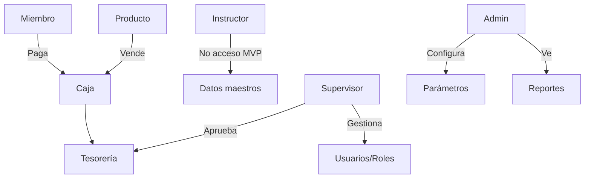
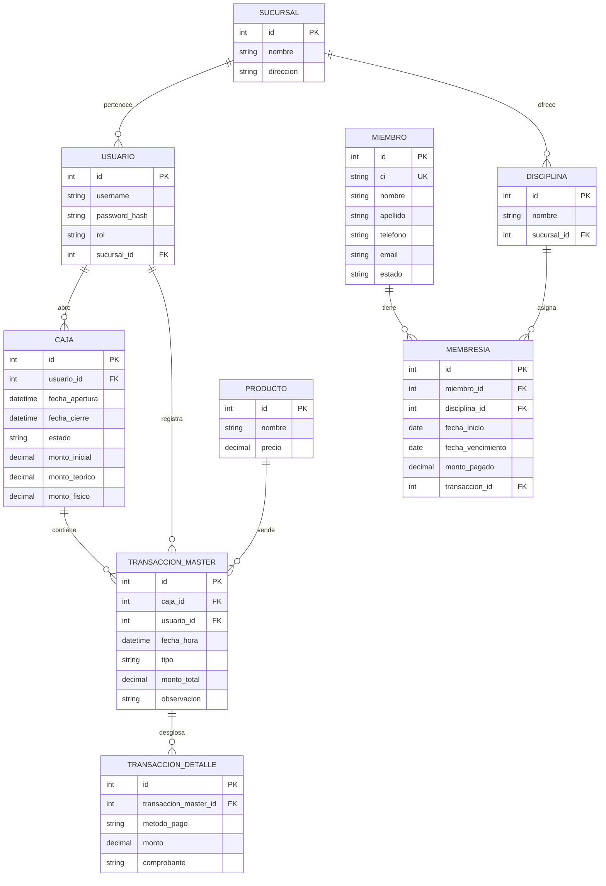

# **SOFTWARE REQUIREMENTS SPECIFICATION (SRS)**

## **Sistema de Gestión de Gimnasio - YakaGym**

**Versión:** 1.0  
**Fecha:** Enero 2026  
**Proyecto:** MVP 2 Meses  
**Moneda:** Guaraníes (PYG)

---

## **1. INTRODUCCIÓN**

### 1.1 Propósito
Este documento establece los requisitos funcionales y no funcionales para el Sistema de Gestión de Gimnasio YakaGym, que reemplazará los procesos manuales actuales (cuadernos) por un sistema informático centralizado para control de membresías, cobranzas, caja e inventario básico.

### 1.2 Audiencia
- **Desarrolladores**: Para diseño e implementación
- **Propietario**: Validación de negocio
- **Cajeros/Supervisores**: Capacitación y usabilidad

### 1.3 Definiciones

| Término | Definición |
|---------|------------|
| **Miembro** | Cliente activo con membresía vigente |
| **Membresía** | Suscripción a una disciplina (30 días naturales) |
| **Caja** | Sesión de cobranza con estados: ABIERTA, CERRADA, CONTABILIZADA |
| **Transacción** | Pago registrado (membresía, producto, ingreso/egreso varios) |
| **Tesorería** | Control global de saldos y movimientos (incluye cajas) |
| **Contabilizado** | Estado final, solo revertible por Supervisor con log de auditoría |

---

## **2. DESCRIPCIÓN GENERAL DEL SISTEMA**

### 2.1 Perspectiva del Sistema



**Arquitectura MVP**: Mono-sucursal, multi-cajero, rol de Admin único.

### 2.2 Funciones Principales

| Módulo | Prioridad | Funcionalidad Clave |
|--------|-----------|-------------------|
| **Membresías** | MUST | CRUD, alertas vencimiento, suspensión automática |
| **Caja/Tesorería** | MUST | Estados, arqueo, múltiples métodos pago, ajustes |
| **Cobranzas** | MUST | Pagos mixtos (efectivo + transferencia), reimpresión |
| **Productos** | MUST | Catálogo básico, stock simple (sin cálculo costo) |
| **Usuarios** | MUST | Roles: Admin, Supervisor, Cajero |
| **Instructores** | DEFERRED | Solo registro de datos (pagos en futura fase) |
| **Asistencias** | DEFERRED | Control de ingreso miembros (futura fase) |

### 2.3 Restricciones de Diseño

- **PMV**: No incluye integración con pasarelas de pago (registro manual)
- **PMV**: No incluye impresión de tickets
- **PMV**: Reportes básicos (no BI/exploración de datos)
- **Arquitectura**: Preparada para multi-sucursal (flag en base de datos, pero UI oculta)

---

## **3. REQUISITOS FUNCIONALES ESPECÍFICOS**

### **3.1 Módulo de Miembros**

**RF01 - Registrar Miembro**  
**Actor**: Cajero/Supervisor/Admin  
**Descripción**: Crear nuevo miembro con datos personales y asignar membresía inicial.  
**Pre-condiciones**: Caja ABIERTA (si se cobra matrícula)  
**Flujo Normal**:
1. Sistema muestra formulario: Nombre, Apellido, CI, Teléfono, Email (opcional)
2. Usuario selecciona disciplina (musculación/crossfit/funcional)
3. Sistema muestra precio base de membresía
4. Usuario aplica descuento (si corresponde) y método de pago
5. Sistema genera alerta: "Membresía vence: [fecha +30 días]"
6. Sistema registra transacción en caja actual

**Criterios de Aceptación:**
- CI debe ser único en sistema
- Teléfono opcional pero validado formato (ej: +595 981 123 456)
- Email opcional, pero si se ingresa debe validar formato
- Descuento: porcentaje o monto fijo, registrado en log

**RF02 - Consultar Estado de Miembro**  
**Actor**: Cajero/Supervisor/Admin  
**Descripción**: Verificar si membresía está ACTIVA o VENCIDA.  
**Flujo**: Buscar por CI o Nombre → Sistema muestra:
- Estado: ACTIVA (verde) / VENCIDA (rojo)
- Días restantes (si aplica)
- Disciplina actual

**RF03 - Cambiar Disciplina**  
**Actor**: Supervisor/Admin  
**Descripción**: Miembro solicita cambiar de disciplina pagando diferencia.  
**Reglas de Negocio**:
- Si nueva disciplina > valor actual: pago solo la diferencia
- Si nueva disciplina < valor: NO hay devolución (registrado como pérdida)
- Fecha vencimiento NO cambia

**RF04 - Suspensión Automática por Vencimiento**  
**Actor**: Sistema (batch diario 00:00)  
**Descripción**: Detectar membresías con fecha_vencimiento = hoy y marcar como VENCIDA.  
**Criterio**: Miembro con estado VENCIDA no puede realizar nuevos pagos (solo renovación)

### **3.2 Módulo de Membresías y Alertas**

**RF05 - Alertas de Vencimiento**  
**Actor**: Sistema  
**Descripción**: Generar lista de miembros con vencimiento en 3-5 días.  
**Medio**: Visual en dashboard (PMV). Futuro: WhatsApp/email.

**RF06 - Renovación de Membresía**  
**Actor**: Cajero  
**Descripción**: Miembro paga antes/día del vencimiento.  
**Regla**: Fecha nueva = fecha_pago + 30 días (NO acumula si paga antes)

**RF07 - Pago por Día (Pase)**  
**Actor**: Cajero  
**Descripción**: Venta de acceso diario a 1 disciplina.  
**Precio**: Configurable por Admin.  
**Vigencia**: Solo el día de compra (hasta cierre del gimnasio)

### **3.3 Módulo de Caja y Tesorería**

**RF08 - Apertura de Caja**  
**Actor**: Cajero  
**Descripción**: Iniciar sesión de caja con monto inicial.  
**Reglas**:
- Solo 1 caja ABIERTA por Cajero
- Puede abrir/cerrar múltiples veces al día (ej: turno mañana/tarde)
- Monto inicial registrado como "Ingreso Varió"

**RF09 - Registro de Transacción**  
**Actor**: Cajero  
**Descripción**: Registrar pago de membresía o producto.  
**Datos**:
- Tipo: MEMBRESÍA | PRODUCTO | INGRESO_VARIO | EGRESO_VARIO
- Método: EFECTIVO | TRANSFERENCIA | QR | TARJETA
- Monto (puede ser 0 si es solo log)
- Detalle de pago (puede ser mixto: $70 efectivo + $30 transferencia)

**RF10 - Pago Mixto (CRÍTICO)**  
**Actor**: Cajero  
**Descripción**: Una transacción con múltiples métodos de pago.  
**Ejemplo**: Membresía $100 = $70 transferencia + $30 efectivo  
**Registro**:
- Transacción_MASTER (monto total = $100)
- Transacción_DETALLE (2 registros: $70 transferencia, $30 efectivo)

**RF11 - Cierre de Caja (Estado: CERRADA)**  
**Actor**: Cajero  
**Descripción**: Finalizar turno, preparar arqueo.  
**Proceso**:
1. Sistema calcula: Ingresos - Egresos = Saldo teórico
2. Cajero ingresa: Saldo físico contado
3. Si hay diferencia:
   - FALTANTE: Registra egreso "Ajuste por faltante"
   - SOBRANTE: Registra ingreso "Ajuste por sobrante"
4. Estado cambia a CERRADA (solo permite consulta, no transacciones)

**RF12 - Contabilización de Caja**  
**Actor**: Supervisor/Admin  
**Descripción**: Aprobar cierre y pasar a estado CONTABILIZADA.  
**Reglas**:
- Solo Supervisor puede CONTABILIZAR
- Una vez CONTABILIZADA, solo Supervisor puede REABRIR
- Reapertura = misma sesión, con log de auditoría (razón, fecha, usuario)

**RF13 - Reapertura de Caja Contabilizada**  
**Actor**: Supervisor  
**Descripción**: Habilitar edición de caja ya contabilizada para ajustes.  
**Log requerido**: 
```
[2026-01-15 14:30] Supervisor Juan Pérez reabrió caja #1234
Razón: "Faltó registrar pago de membresía de María González"
Acción: Se agregó transacción #5678 por G. 50.000
[2026-01-15 14:45] Cierre re-contabilizado
```

**RF14 - Reporte de Arqueo Diario**  
**Actor**: Cajero/Supervisor  
**Descripción**: Imprimir/exportar reporte de caja cerrada.  
**Contenido**:
- Monto inicial
- Ingresos detallados por tipo/método
- Egresos varios
- Diferencia y ajustes
- Saldo final cuadrado

### **3.4 Módulo de Productos e Inventario**

**RF15 - Catálogo de Productos**  
**Actor**: Admin/Supervisor  
**Descripción**: Gestionar productos (agua, powerade, suplementos).  
**Datos**: Nombre, Precio Venta (PMV), Stock actual (solo decremento manual)  
**NOTA**: Costo y margen diferido a Fase 2

**RF16 - Venta de Producto**  
**Actor**: Cajero  
**Descripción**: Registrar venta desde caja.  
**Reglas**:
- No valida stock (PMV)
- Descuenta stock manualmente (si Admin actualiza)
- Puede ser pago mixto

**RF17 - Actualización de Stock**  
**Actor**: Admin/Supervisor  
**Descripción**: Ajustar stock físico (ej: llegó nueva mercadería).  
**Log**: Registra usuario, fecha, cantidad, motivo

### **3.5 Módulo de Usuarios y Permisos**

**RF18 - Gestión de Usuarios**  
**Actor**: Admin  
**Roles**:
- **Admin**: Full access + config precios + tesorería global
- **Supervisor**: Reapertura caja + reportes sucursal + ver todas las cajas
- **Cajero**: Solo su caja + transacciones + miembros

**RF19 - Autenticación**  
**Descripción**: Login con usuario/clave.  
**Requisitos**: 
- Clave mínimo 8 caracteres
- Bloqueo tras 5 intentos fallidos (desbloqueo por Admin)
- Sesión expira tras 30 min de inactividad

**RF20 - Auditoría**  
**Actor**: Sistema  
**Loguea**: 
- Inicios de sesión (usuario, fecha, IP)
- Transacciones (tipo, monto, método)
- Cambios de estado de caja
- Reaperturas (usuario, razón)

### **3.6 Reportes (PMV)**

**RF21 - Reporte de Miembros Activos**  
Filtros: Por disciplina, fecha de vencimiento rango

**RF22 - Reporte de Ingresos por Período**  
- Totales: por método de pago, por tipo (membresía/producto)
- Por Cajero
- Por día/semana/mes

**RF23 - Reporte de Vencimientos Próximos**  
Lista automática de miembros con vencimiento en 3-5 días (configurable)

---

## **4. REQUISITOS NO FUNCIONALES**

### 4.1 Rendimiento (RNF)

**RNF01 - Tiempo de Respuesta**  
- Consulta estado de miembro: < 2 segundos con 70 consultas simultáneas
- Registro de transacción: < 3 segundos
- Cierre de caja: < 10 segundos

**RNF02 - Capacidad**  
- Soporte: 500 miembros, 100 transacciones/día pico
- Base de datos: Diseñada para migración a multi-sucursal (flag sucursal_id)

### 4.2 Seguridad (RNF)

**RNF03 - Control de Acceso**  
- RBAC (Role-Based Access Control) con permisos granularizados (ver RF18)
- Cajero solo ve su caja actual y cerradas propias

**RNF04 - Confidencialidad**  
- Precio costo (cuando exista): Solo Admin
- Reportes tesorería global: Admin + Supervisor
- Datos miembros: Todos los roles (solo lectura)

**RNF05 - Integridad**  
- CI único en tabla miembros
- Montos no editables una vez contabilizada la caja (solo reapertura con log)
- Transacciones no eliminables (solo reversos con log)

### 4.3 Disponibilidad (RNF)

**RNF06 - Recuperación**  
- **RTO (Recovery Time Objective)**: 30 minutos
- **RPO (Recovery Point Objective)**: 24 horas (backup diario)
- **Estrategia**: EC2 + script cron a S3 (implementación en Fase 1.5)

**RNF07 - Conectividad**  
- Conexión internet requerida (no offline PMV)
- Timeout: 15 segundos antes de mensaje de error

### 4.4 Usabilidad (RNF)

**RNF08 - Experiencia de Cajero**  
- Proceso venta: Máximo 5 clicks desde búsqueda de miembro hasta confirmación
- Teclas rápidas: F1=Buscar miembro, F2=Nuevo pago, F5=Actualizar
- Formulario: Validación en tiempo real (no esperar submit)

**RNF09 - Tolerancia a Errores**  
- Si cierra ventana sin guardar: Confirmación "¿Seguro que desea salir?"
- Cierre de caja por error: Supervisor puede REABRIR (misma sesión, log obligatorio)
- Rollback: No hay DELETE físico, solo estados "ANULADO" con razón

**RNF10 - Capacitación**  
- Manual de usuario incluido (PDF)
- Tiempo capacitación Cajero: < 2 horas
- Tiempo capacitación Supervisor: < 4 horas

### 4.5 Escalabilidad (RNF)

**RNF11 - Preparación Multi-sucursal**  
- Tablas con campo `sucursal_id` (nullable PMV)
- Configuración de precios por sucursal (PMV: precio único, futuro: tabla de precios)
- No hay UI de selección de sucursal en PMV

**RNF12 - Exploración de Datos**  
- PMV: Reportes fijos (no dinámicos)
- Futuro: API para BI en Fase 2

### 4.6 Infraestructura (RNF)

**RNF13 - Plataforma**  
- Servidor: AWS EC2 (t3.micro o similar)
- BD: PostgreSQL 15+ o MySQL 8+
- Aplicación: Web responsive (acceso desde PC/tablet)
- OS Cliente: Windows 10/11 (Chrome/Firefox)

**RNF14 - Backup**  
- **Frecuencia**: Diario 02:00 AM (cron)
- **Destino**: S3 bucket con retención 30 días
- **Tipo**: SQL dump + backup incremental
- **Restauración**: Script automatizado (documentado en Anexo)

**RNF15 - Regulaciones**  
- **Respaldo**: 5+ años de datos (exportación anual a archivo comprimido)
- **SET Paraguay**: No facturación electrónica en PMV (talonario manual vigente)
- **Auditoría**: Logs no alterables (solo append)

---

## **5. MODELO DE DATOS CONCEPTUAL**

### 5.1 Diagrama Entidad-Relación (Simplificado)



### 5.2 Reglas de Integridad Referencial

1. **DELETE RESTRICT**: No se puede eliminar `MIEMBRO` si tiene `MEMBRESIA` activa/vencida (solo desactivar)
2. **CASCADE**: Al CONTABILIZAR `CAJA`, todas `TRANSACCION_MASTER` quedan inmutables
3. **AUDIT**: Tabla `LOG_AUDITORIA` inserta registro en cada UPDATE/DELETE crítico

---

## **6. CRITERIOS DE ACEPTACIÓN DEL MVP**

| ID | Funcionalidad | Criterio de Aceptación | Validación |
|----|---------------|------------------------|------------|
| **CA01** | **Login** | Cajero inicia sesión en < 10 segundos | Prueba de carga 10 usuarios |
| **CA02** | **Pago Mixto** | Registrar pago $100 = $70 transf + $30 efectivo en < 5 clicks | Usuario de prueba |
| **CA03** | **Alerta Vencimiento** | Sistema muestra lista de 3-5 días en dashboard | 20 miembros de prueba |
| **CA04** | **Cierre Diferencia** | Cajero cierra con faltante G. 10.000, sistema genera ajuste automático | Simulación |
| **CA05** | **Reapertura** | Supervisor reabre caja contabilizada, log muestra razón y usuario | Log visible en BD |
| **CA06** | **Rendimiento Pico** | 70 consultas simultáneas de estado miembro < 2 seg cada una | JMeter 100 req/s |
| **CA07** | **Recuperación** | Backup diario restaurado en < 30 minutos | Simulación diaria |
| **CA08** | **Migración Datos** | Importar 300 miembros desde Excel en < 15 minutos | Script de migración |

---

## **7. REQUISITOS DIFERIDOS (FASE 2+)**

| # | Funcionalidad | Motivo de Diferimiento | Estimación Fase 2 |
|---|---------------|------------------------|-------------------|
| **DF01** | Control Asistencia Miembros | Requiere hardware (lector QR/RFID) | 40 horas |
| **DF02** | Inventario Costo/Margen | Aumenta complejidad contable | 30 horas |
| **DF03** | Facturación Electrónica SET | Dependencia regulatoria no urgente | 80 horas |
| **DF04** | App Móvil Miembros | No crítico para operación base | 120 horas |
| **DF05** | Multi-sucursal UI | MVP mono-sucursal validado | 60 horas |
| **DF06** | Pagos Instructores | Módulo de nómina separado | 50 horas |

---

## **8. APÉNDICES**

### 8.1 Estimación de Esfuerzo (Horas/Hombre)

| Módulo | Diseño | Desarrollo | Pruebas | Total |
|--------|--------|------------|---------|-------|
| **Miembros** | 12 | 30 | 10 | 52 |
| **Membresías** | 8 | 25 | 8 | 41 |
| **Caja/Tesorería** | 20 | 45 | 15 | 80 |
| **Productos** | 6 | 15 | 5 | 26 |
| **Usuarios/AUD** | 10 | 20 | 8 | 38 |
| **Reportes** | 8 | 18 | 6 | 32 |
| **Infraestructura** | 5 | 15 | 5 | 25 |
| **Documentación** | - | - | - | 20 |
| **TOTAL MVP** | **69** | **168** | **57** | **314** |

**Costo Estimado**: 314 horas × G. 65.000/h = **G. 20.410.000** (ajustado a su presupuesto G. 20M)

### 8.2 Stack Tecnológico Recomendado

- **Backend**: Python 3.11 + Django 5.0 (rapidez desarrollo)
- **Frontend**: Django Templates + Bootstrap 5 (no SPA para PMV)
- **BD**: PostgreSQL 15 (mejor para auditoría)
- **Servidor**: AWS EC2 t3.micro (free tier 12 meses)
- **Backup**: Script Bash + cron + S3
- **Monitor**: AWS CloudWatch (logs básicos)

### 8.3 Hitos de Entrega

| Fecha | Entregable | Validación |
|-------|------------|------------|
| **Semana 4** | Módulos Miembros + Membresías | CA01, CA03 |
| **Semana 6** | Módulo Caja (Operaciones básicas) | CA02, CA04 |
| **Semana 7** | Productos + Usuarios | RF15-RF20 |
| **Semana 8** | Reportes + Pruebas integración | CA05-CA08 |
| **Semana 8+2 días** | Capacitación + Ajustes finales | Manual + Demo |

---

## **9. APROBACIÓN DEL SRS**

| Rol | Nombre | Firma | Fecha |
|-----|--------|-------|-------|
| **Cliente** | [Nombre Propietario] | ____________ | _________ |
| **Analista** | Ingeniero Requerimientos | ____________ | 26-01-2026 |
| **Project Manager** | [Asignar] | ____________ | _________ |

---

**NOTA**: Este SRS es vinculante para el desarrollo del MVP. Cualquier cambio requiere formalización de Change Request y re-estimación de tiempo/costo.